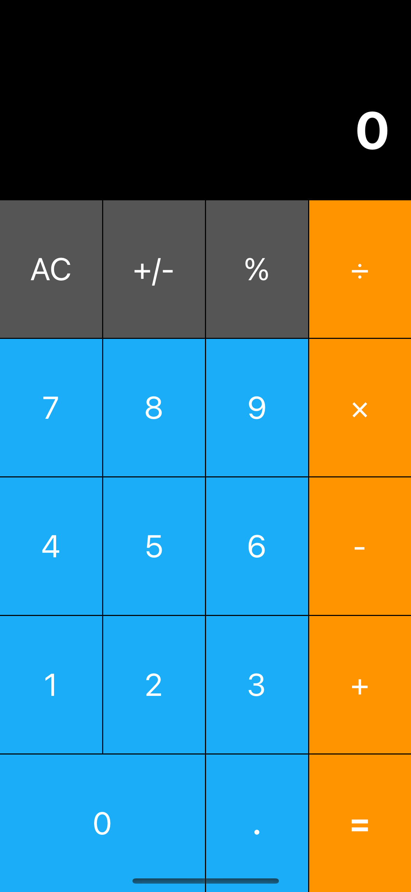

# Curso-Objective-C 📚
## Día 1 ✅
### Temas 
* Introducción
* Conociendo Xcode
* Generalidades del lenguaje
* Debugger
* Clases y Objetos
* Métodos
* Herencia

**Ejercicio**: 

Crear una clase <code>Animal</code>, la cuál tendrá propiedades privadas y públicas. Crear una clase <code>Gato</code> que herede de <code>Animal</code> y que tenga varios métodos.

Además, crear una clase <code>Perro</code> que herede de <code>Animal</code> y que tenga varios métodos.

## Día 2 ✅
### Temas 
* Manejo de memoria
* Propiedades
* Bloques
* Categorías
* Protocolos

## Día 3️⃣
### Temas 
* Diseño de interfaces

## Día 4️⃣
### Temas 
* Utilización de Swift en proyectos de Objective-C

# Proyecto Final 📱

El proyecto final consiste en añadir algunos IBOutlets y IBActions para la calculadora proporcionada en storyboard.

# Forma de evaluación 📝

| **Actividad** | **Porcentaje** |
| --- | :---: |
| Proyecto Final | 50% |
| Tareas  | 40% |
| Participación | 10% |

# Presentación 🎬

En la carpeta de <a href="https://github.com/xDiegoNunezx/Curso-Objective-C/tree/main/recursos">/recursos 📁</a> podrás encontrar la presentación ocupada durante todo el curso.

# Recursos 💍
A continuación se listan los recursos que se utilizaron para el desarrollo de este curso.

## Sitios Web 🌐
<ul>
	<li><a href="https://developer.apple.com/library/ios/documentation/Cocoa/Conceptual/ProgrammingWithObjectiveC/Introduction/Introduction.html">Documentación oficial de Objective-C</a></li>
	<li><a href="https://github.com/iwasrobbed/Objective-C-CheatSheet">Objective-C Cheat Sheet</a></li>
	<li><a href="https://www.hackingwithswift.com/articles/114/objective-c-to-swift-conversion-cheat-sheet">Hacking With Swift: Convert Objective C to Swift</a></li>
</ul>

## Libros 📚

* Objective-C: The Big Nerd Ranch Guide
    * [PDF](https://github.com/xDiegoNunezx/Curso-Objective-C/tree/main/recursos)
    * <a href="https://fiunamedu-my.sharepoint.com/:b:/g/personal/diego_nunez_fi_unam_edu/Eca9ljkJG2pNmsugS5JElRsBJYQ1onZo0tP1NMJ5tT_Yhg?e=fiVZwe">Host Web (Diego)</a>
* <a href="https://cloudflare-ipfs.com/ipfs/bafykbzacec6ephme2ckyk3m3x4xtawzunhqkb7zxvytnbqr53aidppvukw6nu?filename=objective-c-fundamentals-christopher-fairbairn-1--annas-archive--libgenrs-nf-761035.pdf">Objective C Fundamentals</a>	
